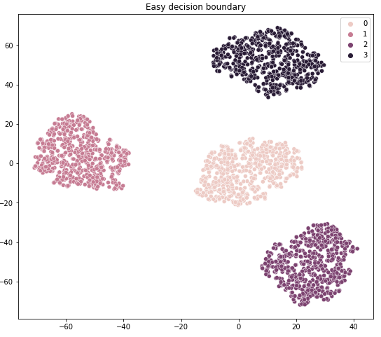
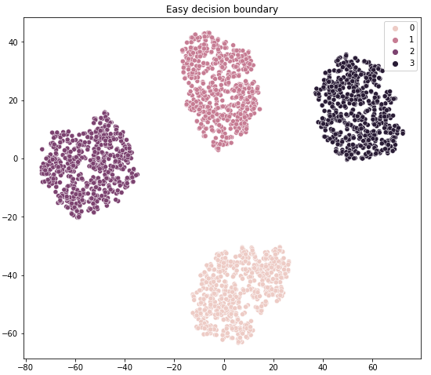
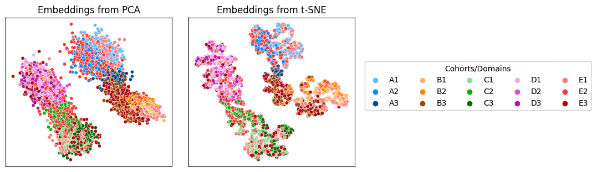
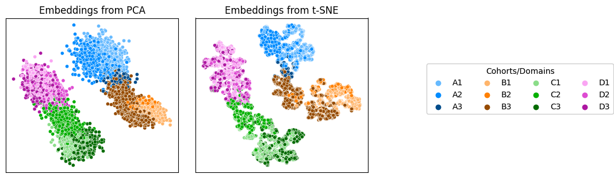
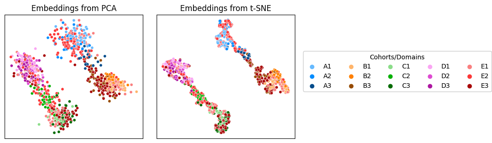
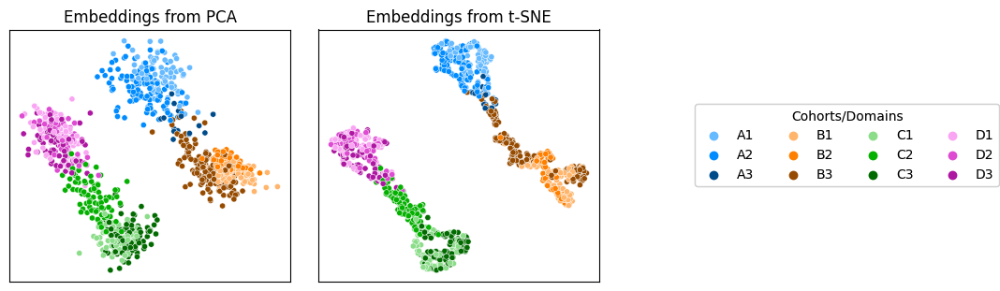
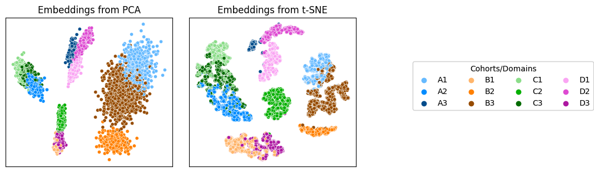

# PyFlow_DomainAdaptation: 
##### Author: Talip Ucar (ucabtuc@gmail.com)

A model for domain adaptation/translation/alignment. Trained model can be used to translate data from one domain 
to another, or fill in the missing data in one modality by using the available data in another. 
If you are in hurry, and just want to clone the project and run it, move to [Summary](#summary) section. Otherwise, read on...

# Table of Contents:

1. [Model](#model)
2. [Datasets](#datasets)
3. [Environment](#environment)
4. [Configuration](#configuration)
5. [Training](#Training)
6. [Evaluation](#Evaluation)
7. [Results](#results)
8. [Experiment tracking](#experiment-tracking)
9. [Summary](#summary)
10. [Citing this repo](#citing-this-repo)


# Model


The model consists of an Autoencoder together with two Discriminators, one for latent space, and one for reconstructions.

```
    ------------------------------------------------------------
    Architecture:  X -> Encoder -> z -> Decoder -> X' __ Discriminator
                                   |               X  _/
                                   |
                                    \_ Discriminator
                     GMM -> z_prior /
                   
    ------------------------------------------------------------
    Autoencoders can be configured as
                        - Autoencoder (ae),
                        - Variational autoencoder (vae),
                        - Beta-VAE (bvae),
                        - Adversarial autoencoder (aae).
    ------------------------------------------------------------
```


- The autoencoder is trained to learn shared representation from multiple data sources. 

- A conditional Discriminator is used to align the latent representations of the 
data sources. Here, class labels in each domain is used to condition the Discriminator. 

- A second conditional Discriminator is used to improve the quality of reconstructions, i.e. the output of the decoder. This discriminator is 
conditioned on the domain labels ( For example, if there are 3 different data sources, they are labeled in one-hot encoded form as 001, 010, 100).


Two Autoencoder (AE) models are provided; i) CNN-based AE to be used with image data, and ii) Fully-connected AE to be used with tabular data sources. 
Only one of them can be used at any time and all data sources should be of same kind (or you can modify the code to instantiate two of them).

1) A custom CNN-based Autoencoder model is used to learn representation from images. 
Its architecture is defined in yaml file of the model (```./config/ae.yaml```). 

Example: 
<pre>
conv_dims:                   # Architecture for Encoder and Decoder (in reverse order) with convolutional layers
  - [ 1,  64, 4, 2, 1, 1]    # i=input channel, o=output channel, k = kernel, s = stride, p = padding, d = dilation
  - [64,  64, 4, 2, 1, 1]    # [i, o, k, s, p, d]
  - [64, 128, 4, 2, 1, 1]    # [i, o, k, s, p, d]
  - [128, 256, 4, 2, 1, 1]   # [i, o, k, s, p, d]
  - 128                      # Dimension of bottleneck layer 
</pre>

```conv_dims``` defines first 3 convolutional layer as well as dimension of the latent variable, z. You can change this architecture
by modifying it in yaml file. You can add more layers, or change the dimensions of existing ones. 
Architecture is agnostic to input image size. Use "convolution=true" in model config file if you want to use CNN-based model.

2) A custom fully-connected Autoencoder model is used to learn representation from tabular data. 
Its architecture is defined in yaml file of the model (```./config/ae.yaml```). 

Example:
<pre>
dims:        # Autoencoder architecture - This is for Encoder, and Decoder (in reverse order)
  - 1024     # Hidden layer
  - 512      # Hidden layer 
  - 128      # Bottleneck layer
</pre>

**Note:** You don't have to define input dimension i.e. number of features in the dataset since it is automatically added to the model.

3) 
    I) A discriminator is trained using fake samples (latent samples) from encoder and real samples from Gaussian Mixture Model. This is used to map
    classes (i.e. clusters) within each domain to each of the Gaussians in GMM. In this way, the clusters in different domains are aligned.
    The discriminator is a four layer fully-connected neural network with 128 hidden dimensions in each layer, which can be change under "utils>model_utils.py"

    II) A second discriminator is trained using fake samples (reconstructions) from decoder and real ones (original data). 
    This is used to improve to quality of reconstructions. It is a four layer fully-connected neural network with 128 hidden dimensions 
    in each layer, which can be change under "utils>model_utils.py"


# Datasets
The model is tested with tabular data. 3 synthetic datasets are included in the repo to experiment with the model.
Each dataset is assumed to have two files: dataset_tr.csv, and dataset_te.csv. And the labels are assumed to be in the
first column of the tabular data. 

To train the model with your own data, place the data folder under "./data/". So, it should be as following:

<pre>
./data/new_dataset_dir/
                       |_ new_dataset_tr.csv
                       |_ new_dataset_te.csv                        
</pre>

And when training, you can use "-d1, -d2, -d3" arguments to pick the data sources to use. For example, 

<pre>python 0_train.py -d1 "new_dataset" -d2 "ds2" -d3 "ds3"</pre> 

will use new dataset as well as two other synthetic datasets (ds2 and ds3) already provided in the project.


Results of t-SNE for 3 synthetic datasets are as shown below (Each has 4 clusters):

Dataset-1                  |  Dataset-2                |  Dataset-3
:-------------------------:|:-------------------------:|:-------------------------:
      |      |  


# Environment - Installation
It requires Python 3.7 or 3.8 (Default is 3.7). You can set up the environment by following three steps:
1. Install pipenv using pip
2. Activate virtual environment
3. Install required packages 

Run following commands in order to set up the environment:
```
pip install pipenv          # To install pipenv if you don't have it already
pipenv shell                # To activate virtual env
pipenv install --skip-lock  # To install required packages. Torch and Torchvision is commented out. 
pip install torch==1.5.0+cu101 torchvision==0.6.0+cu101 -f https://download.pytorch.org/whl/torch_stable.html
```
Note that torch and torchvision in Pipfile are commented out and are installed separately since other versions of torch with Python 3.7 
was not able to detect GPU even if it is available.

#### Important Note: 
If you want to use Python 3.8, follow these steps:
- Change python_version in Pipfile: ```python_version = "3.8"``` 
- Comment in torch and torchvision in Pipfile (they are commented out in the Pipfile)
- Install the packages as described above in the first 3 steps.

# Configuration
Under the ```./config/``` directory, there are two kinds of yaml files. 

1) ```runtime.yaml``` is a high-level config file, where you define which model to run: 

- **ae**   for autoencoder 
- **vae**  for variarional autoencoder (VAE)
- **bvae** for Beta-VAE 

For now, only **"ae"** mode is tested and its corresponding yaml file (```ae.yaml```) is provided. You need to generate new config 
files (vae.yaml, and bvae.yaml) for other modes.
 
```runtime.yaml``` is also where you define whether you want to track experiments using MLFlow, random seed to use, 
whether to use distributed training (not implemented, just a placeholder for now), and paths for data and results.

2) ```ae.yaml``` is the model specific configurations. The name of these yaml file need to match to the model_mode defined 
in ```runtime.yaml``` so that the script can find and load the model specific configuration.

# Training
Commands for aforementioned two steps as well as for evaluation after training:
```
 I) python 0_train.py  -d1 "ds1" -d2 "ds2" -d3 "ds3"     # Train autoencoder using synthetic datasets provided
II) python 1_eval.py   -d1 "ds1" -d2 "ds2" -d3 "ds3"     # Evaluations of how aligned all domains are.
```

You can change the default arguments for datasets under ```./utils/arguments.py``` so that you don't need to define them when 
training and evaluation. Currently, ds1, ds2, and ds3 are not defaults, and hence you need to provide them as arguments on 
the command line.

# Evaluation
## 1-Evaluation of samples with classification task
Logistic regression model is trained on the original data, and evaluated on the reconstruction of original data as well as 
samples translated from other domains.  


## 2-Visualisation
Latent samples from all domains are projected to 2D using PCA and t-SNE to verify whether the clusters
in all domains are aligned.

## Running evaluation script
Once you have a trained model, you can evaluate the model performance by running:
```
python 1_eval.py   -d1 "ds1" -d2 "ds2" -d3 "ds3"     # Evaluations of how aligned all domains are.
```

This will generate scatter plots of samples in latent space using PCA and t-SNE, in which we can observe how domains 
are aligned in the latent space. It will also report the results of classification task on the command screen.


For further details on what arguments you can use (or to add your own arguments), you can check out "/utils/arguments.py"


# Results

Results at the end of training is saved under "./results" directory. Results directory structure:

<pre>
results
   |- Framework (e.g. semi-supervised)
            |-evaluation          # To save the results of evaluation script
                |-reconstructions # To save the results of inputs and their corresponding reconstruction
                |-clusters        # To save the results of scatter plots to show clustering in each domain as well as the domain alignment. 
            |-training 
                 |-model_name (e.g. aae, or vae (variational autoencoder))  
                     |-model      # To save the models at the end of training.   
                     |-plots      # To save the plots generated during training.   
                     |-loss       # To save csv file containing losses recorded during training.
</pre>

You can save results of evaluations under "evaluation" folder.

## Results with 3 synthetic datasets
### Supervised Setting: 
1) Confirming alignment obtained by training the model with default hyper-parameters on 3 synthetic datasets.
In each figure, the left and right sub-plots are 2D projections from PCA, and t-SNE respectively.


Figure-1: All four clusters (A, B, C, D) in 3 datasets (domains 1, 2, 3) are aligned in the latent space of the Autoencoder, using **Training set**.


Figure-2: All four clusters (A, B, C, D) in 3 datasets (domains 1, 2, 3)  are aligned in the latent space of the Autoencoder, using **Test set**.


Figure-3: All four clusters (A, B, C, D) in 3 datasets (domains 1, 2, 3)  are aligned in the latent space of the Autoencoder, using **training** samples 
that are **translated to Domain-3** (i.e. All data -> Encoder -> Translated to Domain-3 via Decoder -> Encoder -> z).


Figure-4: All four clusters (A, B, C, D) in 3 datasets (domains 1, 2, 3)  are aligned in the latent space of the Autoencoder, using **test** samples 
that are **translated to Domain-3** (i.e. All data -> Encoder -> Translated to Domain-3 via Decoder -> Encoder -> z)

### Semi-Supervised Setting: 
1) Same setting as in supervised case, except that 50% of data points in each dataset was unlabeled 
- E1, E2, E3 in the plots below correspond to unlabeled data in three datasets.
- Data points from E1, E2, E3 are clustered together with correct clusters (A, B, C and D) in all 3 data sources, showing that the model was able to identify the correct cluster of the unlabelled data. (Note that the latent dimension = 2 is used to make visualisation easier - So, PCA and t-SNE are rather unnecessary, and they just shuffle the position of the data points)





Figure-5: The model is trained with 50% labeled, and 50% unlabeled data. All four clusters (A, B, C, D) in 3 datasets (domains 1, 2, 3) are aligned in the latent space of the Autoencoder, using **Training set**. At the top row, unlabeled data points are shown as Legend E-1,2,3 correspond to unlabeled data points in three datasets, and they are shown to cluster together with their true cluster in each of three datasets. At the bottom row, same unlabeled data points are colored with their actual cluster label, confirming that they were assigned to their true cluster.





Figure-6: Same setting as above, showing the results on the **Test set**.

### Unsupervised Setting: 
This setting uses only the Autoencoder portion of the model to learn representations from all three data sources. Thus, the data-alignment is not the goal here.


Figure-7: Clustering of data points using unsupervised setting, using **Training set**.


Figure-8: Clustering of data points using unsupervised setting, using **Test set**.


# Experiment tracking
MLFlow can be used to track experiments. It is turned off by default, but can be turned on by changing option in 
runtime config file in ```./config/runtime.yaml```

# Summary
1) Installation of required packages:
It requires Python 3.7 or 3.8 (Default is 3.7). You can set up the environment by following three steps:
<pre>
  i) Install pipenv using pip
 ii) Activate virtual environment
iii) Install required packages 
</pre>

Run following commands in order to set up the environment:
```
pip install pipenv          # To install pipenv if you don't have it already
pipenv shell                # To activate virtual env
pipenv install --skip-lock  # To install required packages. 
pip install torch==1.5.0+cu101 torchvision==0.6.0+cu101 -f https://download.pytorch.org/whl/torch_stable.html
```

2) Training and evaluation of the models:
```
  I) python 0_train.py  -d1 "ds1" -d2 "ds2" -d3 "ds3"     # Train autoencoder using synthetic datasets provided
 II) python 1_eval.py   -d1 "ds1" -d2 "ds2" -d3 "ds3"     # Evaluations of how aligned all domains are.
```

If you want to use Python 3.8, please follow the steps described in [Important Note](#important-note).

# Citing this repo
If you use this work in your own studies, and work, please don't forget to cite the original source.
```
@Misc{talip_ucar_2021_domain_adaptation,
  author =   {Talip Ucar},
  title =    {{Pytorch implementation for Domain Adaptation, Alignment and Translation}},
  howpublished = {\url{https://github.com/talipucar/PyFlow_DomainAdaptation}},
  month        = March,
  year = {since 2021}
}
```

